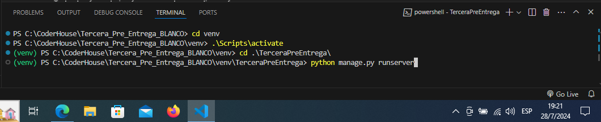
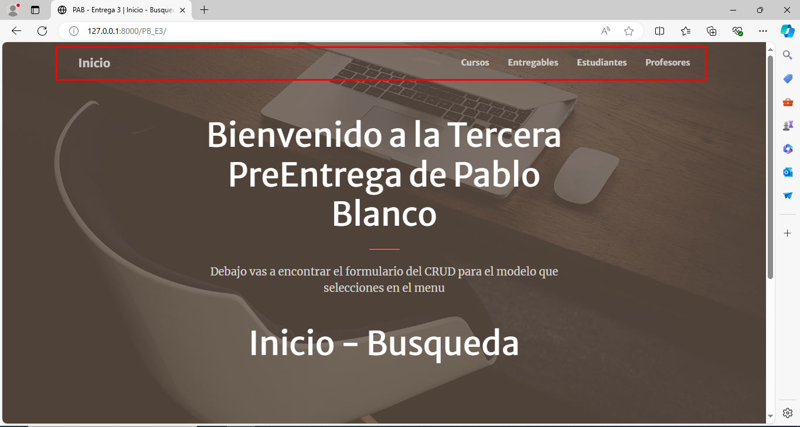
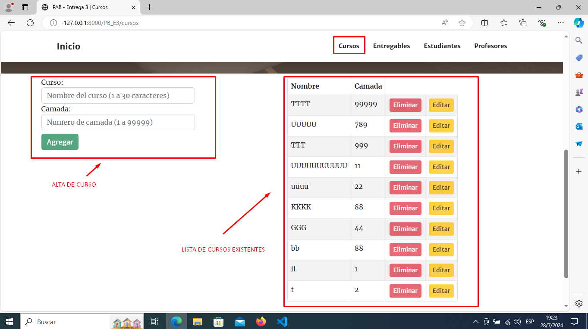
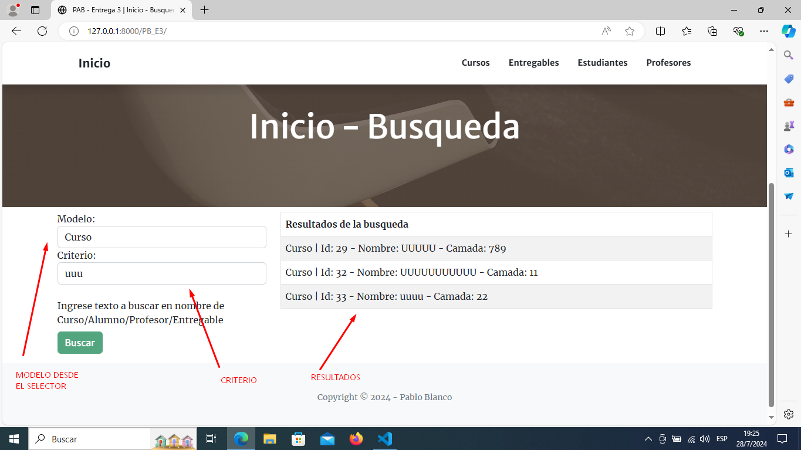
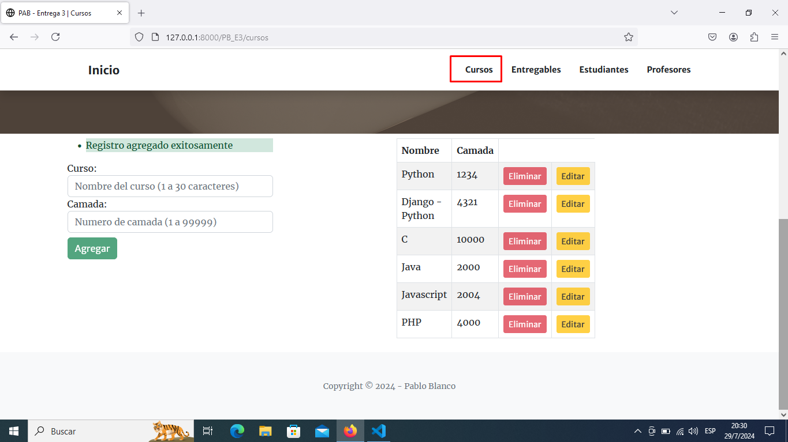
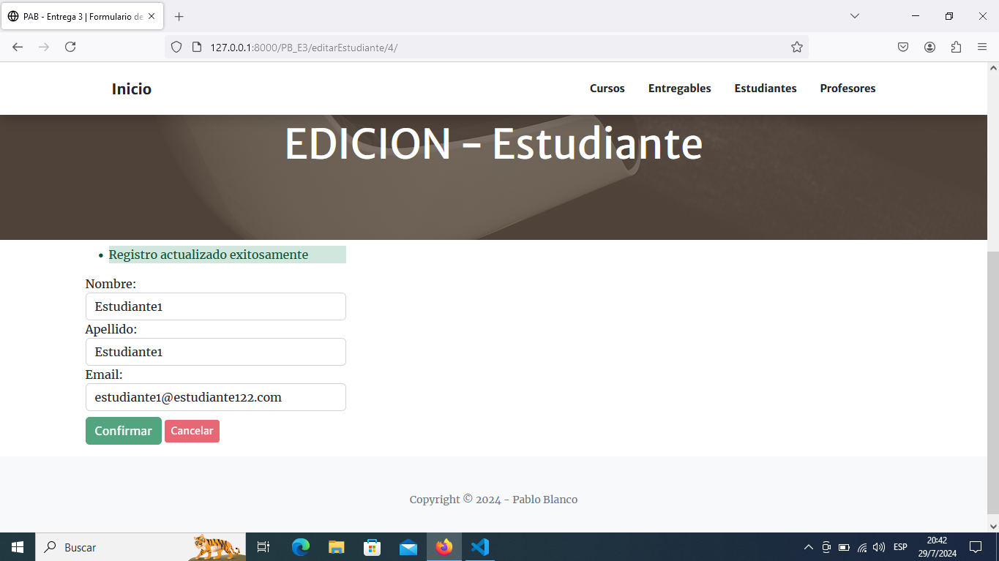
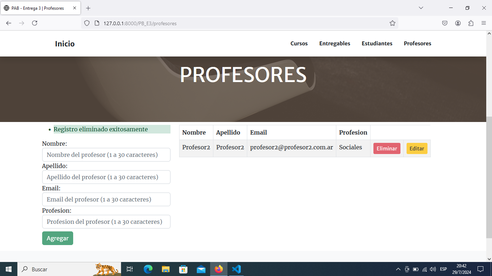
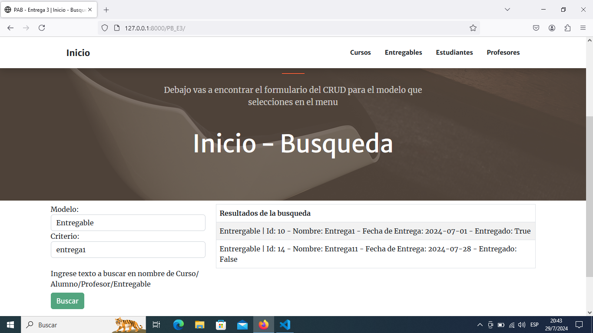

Tercera Pre Entrega Pablo Blanco:

- El proyecto fue realizado en un entorno virtual dentro de la carpeta "venv"

- Se incluyen archivos "requirements.txt" y "gitignore"

- Activando el entorno virtual y ejecutando el servidor, la direccion de la app es localhost:port/PB_E3

- Una vez en inicio, se van a encontrar las 4 clases vistas en el menu de la navbar y cuando se selecciona un modelo, se despliega debajo de la imagen "base":
    - un formulario para el alta
    - una lista de los elementos existentes en la tabla con los botones "Eliminar" y "Editar" embebidos en cada registro

- En todos los modelos se agregó el ID para poder manejar mas adecuadamente las funciones del CRUD

- El template fue descargado de los sitios compartidos en clase y se modificó de acuerdo a las necesidades.

- En la página inicial se configuró la búsqueda para seleccionar un modelo y buscar el "criterio" dentro del campo "nombre" de cada modelo. En este caso, la vista es la misma y se discrimina según el método y el elemento seleccionado en el dropdown.

- En el caso del CRUD para los modelos, se utiliza un endpoint para borrar y otro para editar, siendo la misma vista del modelo la que genera el alta o la lectura de la información según el método de la request.

- Todos los formularios fueron creados con django forms.

- Ejemplos de las vistas:
    - Alta de un curso:
        

    - Edicion de un estudiante:
        

    - Borrado de un profesor:
        

    - Busqueda de un entregable:
        
